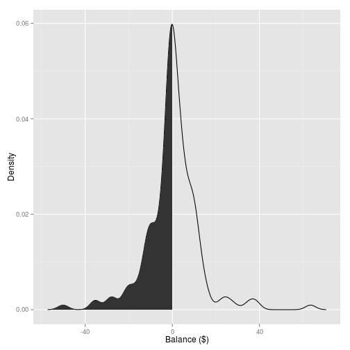

# Report on the state of the Coffee Co-op

It has been 22 days since our sheet was updated. In that time we drank **877 coffees**, of which **712** were marked down; making our honesty during this period **81%**

## The distribution of co-op balances:
among users currently present in the building, **49%** owe the co-op money, representing a total debt of **-264.17$.**  

**Please come and pay Andrew MacDonald (203).  Let's try to improve these numbers!**

 

